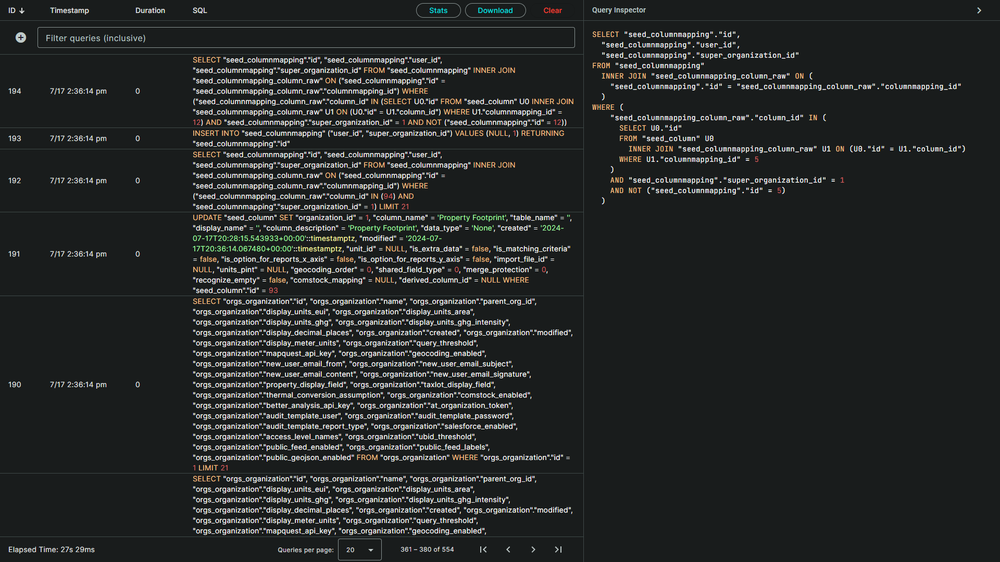
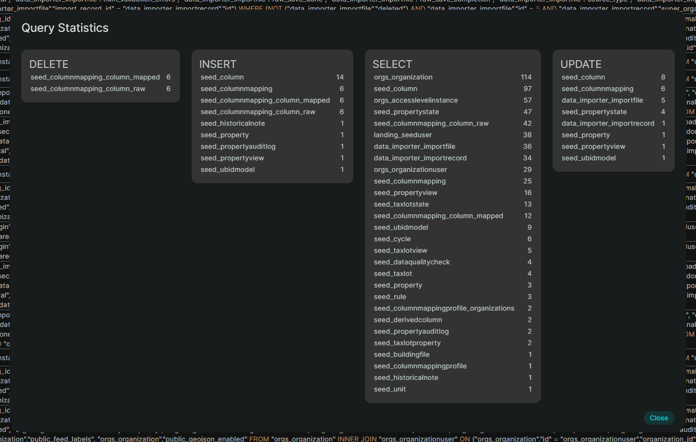

<h1 align="center">Django Query Logger</h1>

This tool allows you to stream the queries that are being executed in realtime from a Django application for review, profiling, filtering, formatting, and analysis.

## Development Setup

### Prerequisites

Install [Bun](https://bun.sh/)

Install the dependencies and compile the interface:

```
bun install
bun run build
```

### Running

1. Configure Django to send queries to the logger's socket on port 9999. In your Django `settings.py` file extend your `LOGGING` configuration with the following entries:

    ```python
    LOGGING = {
        "version": 1,
        "handlers": {
            "socket": {
                "level": "DEBUG",
                "class": "logging.handlers.SocketHandler",
                "host": "localhost",
                "port": 9999,
            },
        },
        "loggers": {
            "django.db.backends": {
                "level": "DEBUG",
                "handlers": ["socket"],
                "propagate": False,
            },
        },
    }
    ```
2. Start the logger with `bun start`
3. Start your Django application
4. Browse to http://localhost:3000/ to review the queries

### Screenshots




